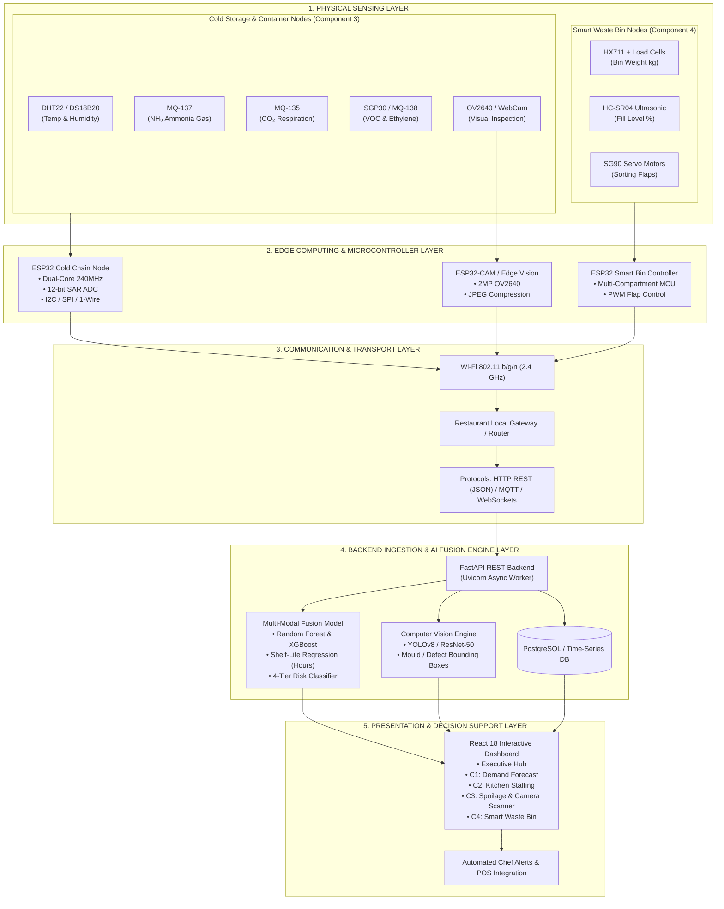
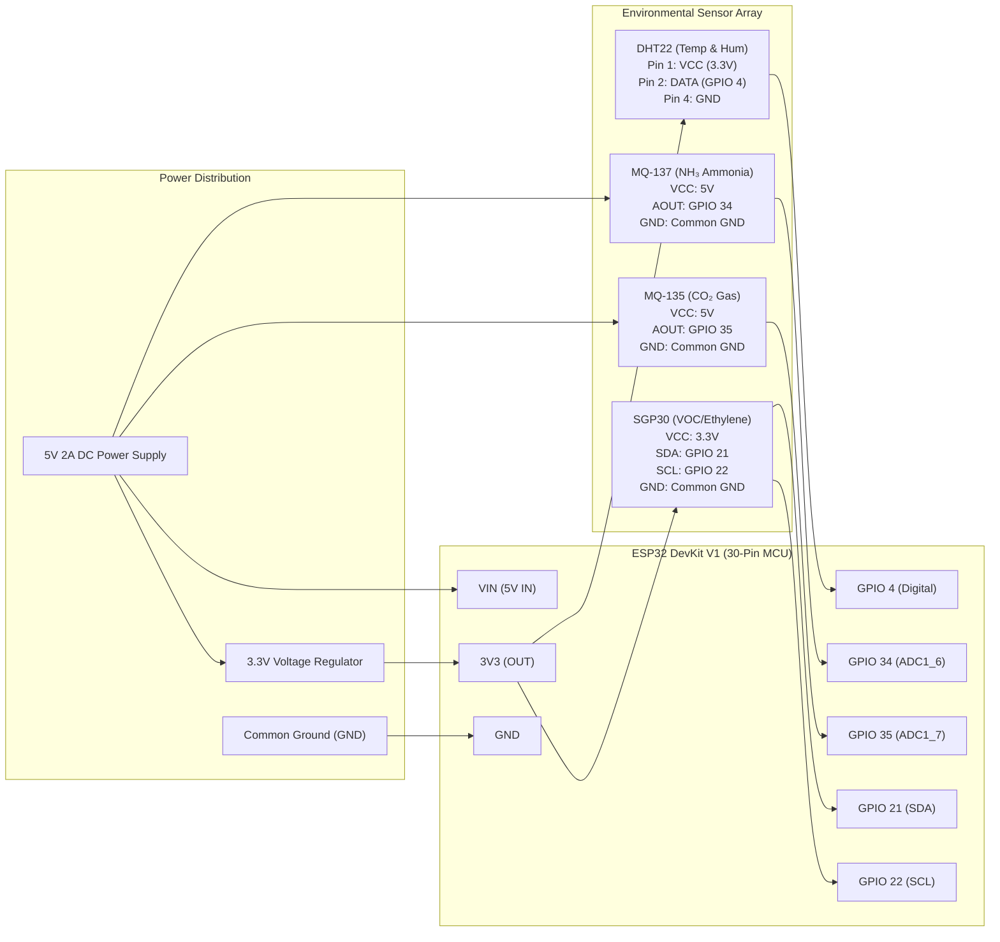
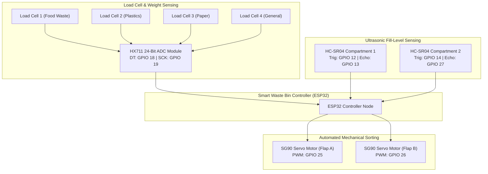
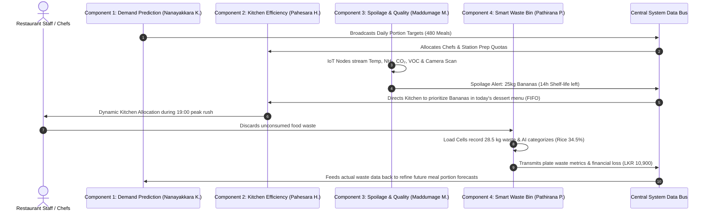

# IoT Hardware Architecture & Circuit Schematic Diagrams
## Research Project: AI & IoT-Based Smart Restaurant Management System (J26-IT-333)

This document contains the complete technical IoT architecture, hardware pinout schematics, communication protocols, and closed feedback loop diagrams required for implementation, thesis documentation, and slide presentation.

---

## 📐 Diagram 1: High-Level End-to-End IoT & AI System Architecture



---

## ⚡ Diagram 2: Component 3 (Food Spoilage) Detailed Hardware Circuit Schematic

### ESP32 Microcontroller Pin Connection Table

| Sensor / Module | Physical Parameter Measured | ESP32 Interface Type | ESP32 GPIO Pin | Operating Voltage |
| :--- | :--- | :--- | :--- | :--- |
| **DHT22 / AM2302** | Temperature & Relative Humidity | Digital Single-Bus | **GPIO 4** (with $4.7\text{k}\Omega$ Pullup) | 3.3V – 5.0V |
| **MQ-137 Sensor** | Ammonia ($\text{NH}_3$) Protein Decomposition | Analog ADC1 (Channel 6) | **GPIO 34** (Analog IN) | 5.0V (VCC) / 3.3V (ADC) |
| **MQ-135 Sensor** | Carbon Dioxide ($\text{CO}_2$) & Air Quality | Analog ADC1 (Channel 7) | **GPIO 35** (Analog IN) | 5.0V (VCC) / 3.3V (ADC) |
| **SGP30 Sensor** | Ethylene Gas & Total VOC | $\text{I}^2\text{C}$ Serial Data (SDA) | **GPIO 21** (SDA) | 3.3V |
| **SGP30 Sensor** | Ethylene Gas & Total VOC | $\text{I}^2\text{C}$ Serial Clock (SCL) | **GPIO 22** (SCL) | 3.3V |
| **OV2640 Camera** | Visual Optical Container Ripeness Inspection | DVP 8-bit Camera Interface | **ESP32-CAM Bus** | 3.3V / 5.0V |
| **Power Supply** | Main System Power | DC Jack / Micro-USB | **VIN / GND** | 5V 2A DC Adaptor |



---

## 🗑️ Diagram 3: Component 4 (Smart Waste Bin) Hardware Circuit Schematic



---

## 🔄 Diagram 4: Closed Feedback Loop Cross-Component Data Interaction



---

## 📡 Diagram 5: IoT Wireless Transmission & Data Payload Schema

When the ESP32 node publishes sensor data, it formats a lightweight JSON payload transmitted over HTTP POST or MQTT:

```json
{
  "node_id": "ESP32_ZONE_01",
  "storage_zone": "Zone 1: Fruit & Berry Preservation Chamber",
  "category": "Fruits",
  "telemetry": {
    "temperature_c": 9.20,
    "humidity_pct": 91.0,
    "nh3_ammonia_ppm": 0.03,
    "co2_ppm": 980.0,
    "voc_ppm": 0.46
  },
  "battery_v": 4.12,
  "rssi_dbm": -64,
  "timestamp": "2026-08-25T10:30:00Z"
}
```

---

## 🎯 How to Use These Diagrams in Your SLIIT Presentation & Thesis:
1. **Slide Presentations (PowerPoint)**:
   - Copy **Diagram 1** into your group system overview slide.
   - Copy **Diagram 2** into your individual 4-minute Component 3 methodology slide to explain the hardware.
   - Copy **Diagram 4** into your wrap-up slide to demonstrate the closed-loop novelty.
2. **Research Proposal / Final Report**:
   - Paste the diagrams and pinout tables directly into Chapter 3 (Methodology & System Architecture).
